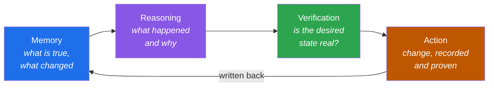

# QA Veritas — AI-Native Verification Engineering

> Most people are using AI to **write code**.
> I'm exploring how AI can **reason about, verify, and operate** complex systems.

[](https://github.com/qa-veritas)
[](https://github.com/qa-veritas)

As systems grow more distributed, the hard part of *quality* moves up the stack — from asserting on a function's return value to reasoning about a cluster's state, proving a change converged, and explaining why a run failed across nodes. AI agents change the economics of that work. But only if they're built with engineering discipline rather than wired to a model and hoped at.

**QA Veritas** is a set of small, runnable components — and the writing around them — that together sketch an emerging discipline: **AI-Native Verification Engineering**. The patterns are vendor-neutral and generic by design. Each one is the smallest honest implementation of an idea, not a framework to adopt.

## The thesis: one loop

An agent you can trust to operate a system runs a single loop. Each component below owns one stage of it.



> **Memory + Reasoning + Verification + Action.** Remove any one and autonomy stops being safe.

## The platform

```
QA Veritas
├── Resource Ledger   — Memory:        operational truth as a versioned git tree
├── State Triage      — Reasoning:     deterministic triage wrapped around one agent
├── LogLens           — Reasoning:     code-aware evidence — read what the code emitted
├── Intent Verify     — Verification:  declarative intent → observable proof (verified/failed/inconclusive)
├── Runbook Forge     — Runbooks:      procedures derived from verified history, not memory
├── SkillPack         — Skills:        agent capability that loads only when a task needs it
└── Future Agents     — Agents:        narrow operators that compose the above into workflows
```

| Layer | Component | The idea it proves |
|-------|-----------|--------------------|
| **Memory** | [Resource Ledger](https://github.com/qa-veritas/resource-ledger) | Operate infrastructure from a git tree an agent reads before it acts and writes after. |
| **Reasoning** | [State Triage](https://github.com/qa-veritas/state-triage) | Parse hard facts deterministically, then let one agent reason — the model never counts. |
| **Reasoning** | [LogLens](https://github.com/qa-veritas/loglens) | Correlate every `file:line` in a log back to the source that emitted it. |
| **Verification** | [Intent Verify](https://github.com/qa-veritas/intent-verify) | Declare desired state; verify it with checks that return verified / failed / **inconclusive**. |
| **Runbooks** | [Runbook Forge](https://github.com/qa-veritas/runbook-forge) | Generate runbooks where every step has actually been performed and verified. |
| **Skills** | [SkillPack](https://github.com/qa-veritas/skillpack) | Progressive-disclosure capability: cheap metadata always, full instructions on match. |
| **Writing** | [Field notes & essays](https://github.com/qa-veritas/writing) | 20 articles, 8 playbooks, talks, and 9 agent designs behind the platform. |

## How the components compose

A worked story uses all of them: a change is checked for **feasibility** against recorded capacity (Resource Ledger), turned into **observable verification** (Intent Verify), and **journaled** — so Runbook Forge can regenerate a trustworthy procedure. When something breaks, **State Triage** parses the facts and plans the investigation while **LogLens** shows the code that emitted the failing line. Throughout, the agents doing the work load only the **SkillPack** skills each task needs.

## Principles

- **Determinism around nondeterminism** — parse facts with code; reserve the model for judgment, never arithmetic.
- **Read before write** — read state, check feasibility, act minimally and reversibly, verify, write back.
- **Verification is the artifact** — a change is done when an observable signal confirms it; "inconclusive" is an honest answer.
- **Memory outlives the session** — knowledge lives in the repo, not in people.

## Start here

New to the platform? Read [**Why QA Is Becoming Infrastructure Engineering**](https://github.com/qa-veritas/writing/blob/main/articles/01-why-qa-is-becoming-infrastructure-engineering.md), then skim [State Triage](https://github.com/qa-veritas/state-triage) and [Resource Ledger](https://github.com/qa-veritas/resource-ledger) — the two crispest ideas, and they run in seconds.

*Everything here is generic and vendor-neutral. MIT licensed. — Ajay Singh*
